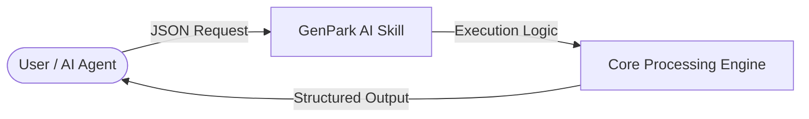

# genpark-hybrid-graph-semantic-postgres-query-router-skill

   

> **GenPark AI Agent Skill** -- Hybrid tabular, graph & semantic vector query router over Postgres for AI agent context retrieval (Polygres style)

## Quick Start
```python
python example_usage.py
```

## 📊 Agentic Architecture Flowchart


## 🔌 MCP Integration
```bash
python mcp_server.py
```
